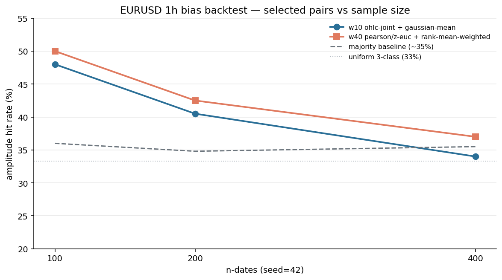
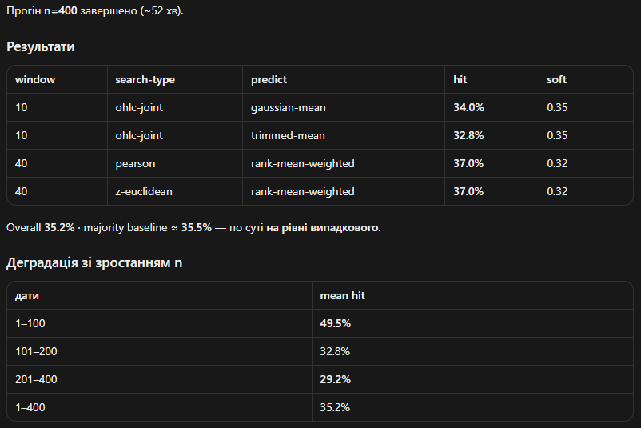
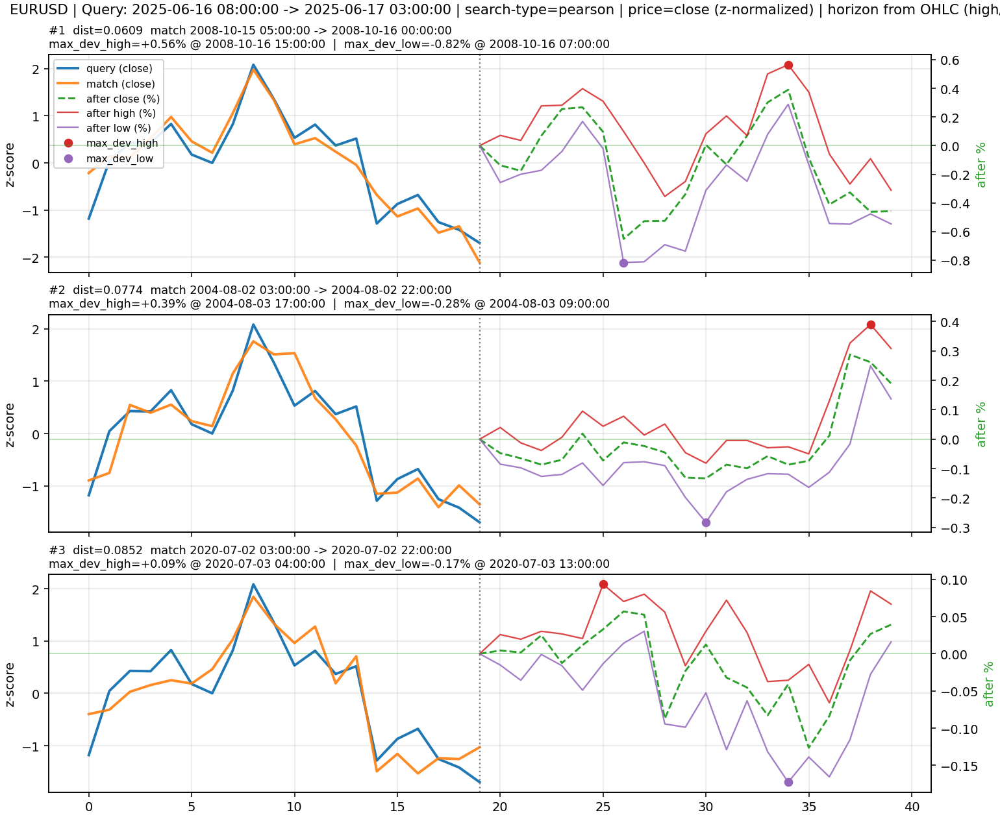

# Time Series Similarity

Research CLI for Forex OHLC time-series similarity: build bars from ticks, find historical windows similar to a query, report forward (horizon) outcomes as a table and chart.





## Setup

```bash
python -m venv .venv
# Windows: .venv\Scripts\activate
pip install -r requirements.txt
```

Run from the repository root (`python main.py ...`).

## Data layout

| Path | Format |
|------|--------|
| `data/ticks/<SYMBOL>_ticks.csv` | `datetime,bid,ask` — datetime `%Y.%m.%d %H:%M:%S.%f` |
| `data/ohlc/<SYMBOL>_<TF>.csv` | `datetime,open,high,low,close` (no header) |
| `output/` | CSV / JSON / PNG results; backtest reports |

## Commands

```bash
# Build OHLC from ticks (multiprocess)
python main.py --prepare --symbol EURUSD --timeframe 1h --workers max

# Find similar windows
python main.py --similarity --symbol EURUSD --timeframe 1h \
  --search-type dtw --start-date "2025-06-16 08:00" \
  --window 20 --horizon 20 --top-k 10

# Several metrics in one run (comma-separated; parallel via --workers)
python main.py --similarity --symbol EURUSD --timeframe 1h \
  --search-type dtw,pearson,z-euclidean --workers max \
  --start-date "2025-06-16 08:00"
```

Example similarity run (`EURUSD` 1h, query `2025-06-16 08:00`, window/horizon 20, top-k 10):




Useful flags: `--price`, `--stride`, `--plots`, `--skip-weekends`, `--max-price-gap` (absolute price units, not pips), `--start-index`, `--workers` (`max` or N; for similarity, one process per search-type), `--output-image png|skip`, `--output-table file|console|skip`, `--output-table-format csv|json`.

Horizon columns on each match: `max_dev_high` / `max_dev_low` (and times). Direction labels use the bias rule in `TASK.md` (`BIAS_MARGIN = 0.20`).

## Search types

| `--search-type` | Notes |
|-----------------|-------|
| `z-euclidean` | z-normalized Euclidean on `--price` |
| `z-manhattan` | z-normalized L1 on `--price` |
| `pearson` / `spearman` / `cosine` | correlation / cosine distances |
| `cid` | Complexity-Invariant Distance (z-normalized) |
| `dtw` / `softdtw` | alignment distances (z-normalized; slow ~window²) |
| `logret` | z-Euclidean on log-returns of `--price` |
| `ohlc-joint` | Euclidean on `concat(z(close), z(range))` |
| `candle-shape` | Euclidean on body/wick ratios |
| `dtw-multiv` | multivariate DTW on z-normalized OHLC (slow) |

Struct metrics (`ohlc-joint`, `candle-shape`, `dtw-multiv`) ignore `--price`. Charts still overlay z-normalized close for visualization.

`--search-type` accepts one value or a comma-separated list (`dtw,pearson`); each type writes its own CSV/PNG. With multiple types, `--workers` runs them in parallel (capped by the number of types).

## Research scripts

### Direction snapshot (one query)

```bash
python scripts/analyze_direction.py --start-date "2025-06-16 08:00" \
  --window 20 --exclude softdtw,dtw-multiv
```

Runs all (or filtered) search types on one query and summarizes long/skip/short shares. Uses a dominance-style label rule; for walk-forward accuracy use the backtest script and `BIAS_MARGIN` from `TASK.md`.

### Walk-forward bias backtest

```bash
# Full grid: random dates × windows × search types × predict modes
python scripts/backtest_search_types.py \
  --n-dates 100 --seed 42 --windows 10,20,30,40 \
  --predict all --exclude softdtw,dtw-multiv,dtw --tag full100

# Narrow pairs via JSON plan (same dates for every window/type)
python scripts/backtest_search_types.py \
  --n-dates 400 --seed 42 \
  --window-plan scripts/amplitude_narrow_plan.json --tag narrow400
```

Key flags:

| Flag | Role |
|------|------|
| `--n-dates` / `--seed` | shared random query starts |
| `--windows` | comma list (ignored if `--window-plan` set) |
| `--predict` | one mode, comma-list, or `all` (22 modes; see `TASK.md`) |
| `--window-plan` | JSON: per-window `{search_type, predict:[...]}` |
| `--exclude` | skip search types (default `softdtw,dtw-multiv`) |
| `--tag` | output filename suffix under `output/` |
| `--margin-conf` | abstain threshold for `margin` / `*-margin` predicts |

Outputs: `output/<SYMBOL>_<TF>_bias_backtest_seed*_n*_<tag>_detail.csv` and `_summary.json`.

**Note:** `soft` (fraction of top-k matching actual; pred still mode) is not the same as `softmax` (distance-softmax weighted vote).

Amplitude bias is a **3-class** problem (~33% uniform / ~35% majority baseline). On EURUSD 1h, large-n backtests (`n=400`) did not show a stable edge over majority — see findings in `TASK.md`.

## Tests

```bash
pytest
# or: python tests/test.py
```

## Spec

See `TASK.md` for the research brief, bias rule, full `--predict` table, and backtest conclusions (Ukrainian).
